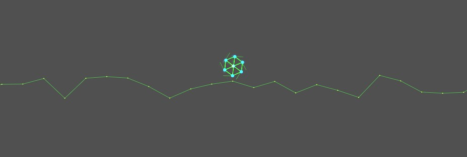

# js-racer

物理演算を使った車両走行シミュレーション

ずっと物理演算を実装してみたかった。
基本はトラスの力学を考えている。
質量系、バネ系、減衰系から力を算出している。

課題
現行のヴァージョンでは、何とか道を走るタイヤを作ることができた。
しかし、回転軸での系の接続が良くモデリングできていない。
併進系と回転系をトラスで解くにはどうしたらよいのか。

## Feature

- v0.1 Tire を実装

## Links

[WebAssemblyでDOMの物理シミュレーション（Google Codelabs）](https://noah.plus/blog/008/)
[Matter.js - a 2D rigid body JavaScript physics engine](http://brm.io/matter-js/)
[Matter.js Demo](http://brm.io/matter-js/demo/#car)
回転系と剛体をピン接合しているデモ

